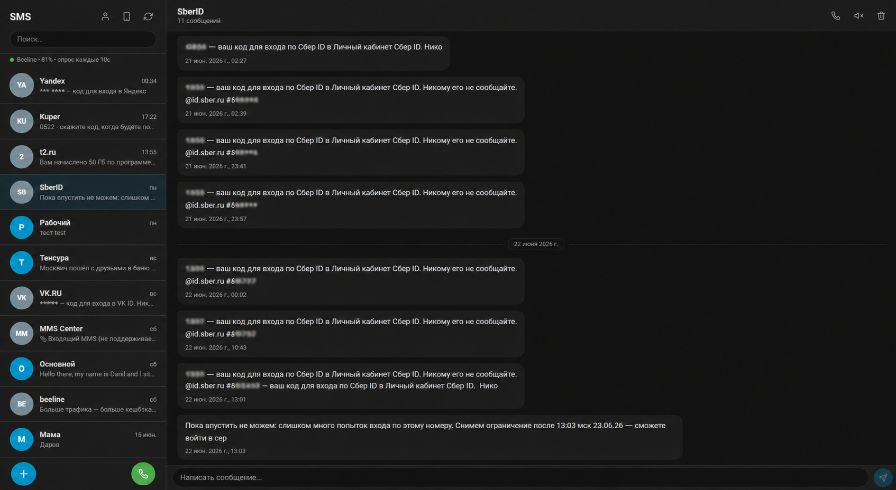

# SMS Gammu Viewer для Home Assistant

[](https://github.com/hacs/integration)
[](https://github.com/BrainDeLook/sms-gammu-viewer-ha/releases)
[](LICENSE)

> 🇬🇧 [English version](README.md)

Нативная панель для **SMS переписки и голосовых звонков** прямо в Home Assistant. Работает с аддоном [sms-gammu-gateway](https://github.com/PavelVe/home-assistant-addons/tree/main/sms-gammu-gateway) и любым совместимым шлюзом на базе [pajikos/sms-gammu-gateway](https://github.com/pajikos/sms-gammu-gateway).

> 💬 **Отправка и приём SMS** · 📞 **Исходящие звонки** · 📇 **Телефонная книга** · 🔔 **Push-уведомления** · 🚪 **Сущности звонков для ворот и домофонов**

После установки в сайдбаре появляется вкладка **SMS**. Сообщения хранятся во внутренней SQLite базе и автоматически удаляются с модема после получения.

<p align="center">
  <br>
  <sub>Десктоп — список диалогов, переписка, поле отправки</sub>
</p>

---


## Возможности

- 💬 **SMS в стиле чата** — все сообщения от одного отправителя в одном диалоге
- 📤 **Отправка SMS** из любого диалога или новый чат через кнопку `+`
- 🔢 **Счётчик символов** с учётом лимитов GSM (160 латиница / 70 кириллица)
- 🔍 **Поиск** по номеру телефона или тексту сообщения
- 📌 **Закрепление диалогов** — закреплённые чаты всегда сверху
- 🔕 **Без звука** — отключение уведомлений для отдельных контактов
- ⭐ **Избранные сообщения** — помечать сообщения, фильтр по звёздочке в шапке чата
- 👆 **Долгое нажатие** (мобиль) / **ПКМ** (десктоп) — копировать, избранное, удалить
- 👈 **Свайпы** (мобиль) — влево: заглушить/удалить, вправо: прочитать/закрепить
- 📞 **Исходящие звонки** через AT-интерфейс
- 📖 **Телефонная книга** — имена контактов в списке чатов и шапке
- 📡 **Страница статуса модема** — сигнал, сеть, SIM, память, прошивка, IMEI
- 💾 **Статистика хранилища** — размер БД и количество сообщений, кнопка очистки
- 🏠 **Сенсоры HA** — непрочитанные, последний SMS, качество сигнала, оператор сети
- 🔔 **Push-уведомления** при новых SMS с открытием чата (iOS и Android)
- 🃏 **Карточка Lovelace** — компактный виджет для дашборда
- 🌍 **Русский / Английский** интерфейс

## Требования

- Home Assistant 2024.3+
- Один из совместимых аддонов SMS-шлюза (см. **Совместимые аддоны** ниже)
- USB GSM модем, поддерживаемый Gammu (например Huawei E1550, E3372, ZTE MF823)
- Для push-уведомлений: приложение [Home Assistant Companion](https://companion.home-assistant.io/)

## Установка

### Через HACS (рекомендуется)

[](https://my.home-assistant.io/redirect/hacs_repository/?owner=BrainDeLook&repository=sms-gammu-viewer-ha&category=integration)

Или вручную:

1. Открой **HACS** в Home Assistant
2. Нажми ⋮ → **Пользовательские репозитории**
3. Вставь: `https://github.com/BrainDeLook/sms-gammu-viewer-ha` — Категория: **Интеграция**
4. Найди **SMS Gammu Viewer** → **Скачать**
5. Перезапусти Home Assistant

### Ручная установка

1. Скачай [последний релиз](https://github.com/BrainDeLook/sms-gammu-viewer-ha/releases)
2. Скопируй `custom_components/sms_gammu_viewer/` в `<config>/custom_components/`
3. Перезапусти Home Assistant

---

## Первоначальная настройка

1. Перейди в **Настройки → Устройства и службы → + Добавить интеграцию**
2. Найди **SMS Gammu Viewer**
3. Заполни форму:

| Поле | Описание | Пример |
|---|---|---|
| **Хост** | IP или hostname аддона | `localhost` или `192.168.1.100` |
| **Порт** | Порт REST API | `5000` |
| **Логин** | Логин аддона | `admin` |
| **Пароль** | Пароль аддона | `password` |

4. Нажми **Отправить** — интеграция проверит подключение
5. В сайдбаре появится иконка **SMS** (💬)

---

## Работа с панелью

- **Открыть диалог** — тапни на контакт в списке
- **Ответить** — введи текст в поле внизу открытого чата, `Enter` — отправить, `Shift+Enter` — новая строка
- **Начать новую переписку** — нажми **«Новое сообщение»** внизу списка контактов, введи номер и текст
- **Скопировать сообщение** — тапни на его текст
- **Удалить сообщение** — наведи/тапни на иконку 🗑 рядом с ним
- **Удалить весь диалог** — нажми иконку корзины в шапке чата
- **Сменить язык** — нажми иконку 🌐 в шапке
- **Посмотреть статус модема** — нажми иконку 📱 в шапке

---

## Сервисы для автоматизаций

Все доступны в **Инструменты разработчика → Сервисы**, в домене `sms_gammu_viewer`:

| Сервис | Поля | Описание |
|---|---|---|
| `sms_gammu_viewer.send_sms` | `number`, `message` | Отправляет SMS |
| `sms_gammu_viewer.call` | `number` | Звонит на номер (требует настроенный голосовой порт) |
| `sms_gammu_viewer.hangup` | — | Принудительно завершает текущий звонок |

### События в шине HA

| Событие | Данные | Описание |
|---|---|---|
| `sms_gammu_viewer_sms_sent` | `number`, `message` | Срабатывает после каждой отправки SMS |
| `sms_gammu_viewer_call_ended` | `phone_number`, `reason` | Срабатывает при завершении звонка (`answered` / `not_answered` / `declined` / `error`) |

Пример:
```yaml
service: sms_gammu_viewer.send_sms
data:
  number: "+79001234567"
  message: "Гаражные ворота остались открыты"
```

---

## Настройки (интервал опроса и уведомления)

Перейди в **Настройки → Устройства и службы → SMS Gammu Viewer → Настроить** (⚙️):

### Интервал опроса

Как часто проверять новые SMS. Минимум 5 секунд, рекомендуется 20–30 секунд.

> При получении SMS интеграция переходит в **режим активного сбора**: опрашивает модем каждые 3 секунды пока симка не будет пустой 5 опросов подряд (~15 секунд тишины). Обычный таймер на паузе. Если длинное сообщение приходит несколькими отдельными волнами в течение 2 минут — части автоматически объединяются в одно сообщение.

### Уведомления на телефон

Выбери устройства из выпадающего списка всех доступных `notify.*` сервисов. Можно выбрать несколько.

Нажатие на уведомление открывает панель SMS напрямую.

**Если устройства нет в списке:**
- Перейди в **Инструменты разработчика → Сервисы** и начни вводить `notify.mobile_app_`
- Или проверь **Настройки → Устройства и службы → Mobile App**

---

## Статус модема и автовосстановление

Нажми кнопку 📱 в шапке панели SMS:

- 📶 Уровень сигнала с визуальной шкалой
- 🌐 Оператор и статус регистрации в сети
- 📟 Производитель, модель, прошивка, IMEI
- 💾 Использование памяти SIM и телефона + IMSI
- 🔄 Кнопка ручной перезагрузки модема

Если модем перестаёт отвечать (5 неудачных опросов подряд), интеграция **сама вызывает сброс модема** и ждёт 15 секунд на восстановление, с паузой 2 минуты между автоматическими сбросами. Пока это происходит, в статус-баре сайдбара показывается предупреждение `⚠ Модем недоступен`.

---

## Голосовые звонки (только дозвон)

Некоторые USB GSM-модемы (особенно Huawei) выставляют **несколько serial-интерфейсов** через одно USB-подключение — обычно один для данных/SMS, другой отдельно для голосовых AT-команд (например `/dev/serial/by-id/...-if00-port0` для данных, `...-if02-port0` для голоса). В таком случае интеграция может дозваниваться напрямую через голосовой интерфейс, полностью независимо от REST API sms-gammu-gateway, **без риска конфликта портов**.

> Эта функция — **только дозвон**. Звонок соединяется и звонит у получателя, но аудио через Home Assistant никуда не передаётся. Полезно для автоматизаций в духе «позвонить мне на телефон» (как дверной звонок, оповещение), а не для полноценного разговора.

### Настройка

1. Узнай путь к голосовому интерфейсу модема:
   ```
   ls -la /dev/serial/by-id/
   ```
   Найди второй путь к устройству, отдельный от того что использует sms-gammu-gateway.
2. Перейди в **Настройки → Устройства и службы → SMS Gammu Viewer → Настроить**
3. Заполни поле **голосовой порт модема** этим путём
4. Сохрани и перезапусти Home Assistant

Оставь поле пустым чтобы полностью отключить эту функцию — на работу SMS она никак не влияет в любом случае.

### Использование

- **Отдельная кнопка звонка** — зелёная плавающая кнопка (📞) появляется рядом с «Новое сообщение» в сайдбаре после настройки голосового порта. Нажми — откроется меню с историей последних 30 звонков (с иконками результата), показывает 4 последних с прокруткой для остальных, и поле для набора нового номера, открытый диалог не нужен.
- **Кнопка в чате** — также доступна в шапке открытой переписки.
- **Автоматизации** — вызови сервис `sms_gammu_viewer.call` с номером телефона:
  ```yaml
  service: sms_gammu_viewer.call
  data:
    number: "+79001234567"
  ```
  Сервис `sms_gammu_viewer.hangup` (без полей) принудительно завершает текущий звонок.
- **Событие** — `sms_gammu_viewer_call_ended` срабатывает с `phone_number` и `reason` (`answered`, `not_answered`, `declined`, `error`) для использования в автоматизациях.

### Совместимость

Нужен модем с поддержкой аппаратного управления потоком (`dsrdtr`/`rtscts`) на голосовом AT-интерфейсе. Подтверждена работа на USB-модемах Huawei на скорости 75600 бод. Если модем выставляет только один serial-порт — функция недоступна, оставь поле пустым.

---

## Сущности звонков (Cover / Button)

Помимо кнопки звонка в панели, можно создать выделенные сущности Home Assistant, которые звонят на фиксированный номер при срабатывании — удобно для ворот, гаражных ворот или домофона, открывающихся по входящему звонку. Они ведут себя как обычные сущности `cover`/`button`, поэтому работают с дашбордами, автоматизациями и голосовыми ассистентами (Алиса, Алекса, Google Home) из коробки.

### Настройка

1. **Настройки → SMS Gammu Viewer → Настроить** — теперь открывается меню, выбери **Сущности звонков**
2. **➕ Добавить сущность**
3. Выбери тип:
   - **Cover** — `open_cover` сразу дозванивается на номер; сущность мгновенно показывает «открыто» (без зависшего состояния «открывается»), пока звонок идёт в фоне. Если включено **автозакрытие** — после завершения звонка (независимо от результата) сущность сама переходит в «закрыто»
   - **Button** — простая кнопка для звонка в один тап, без состояния
4. Укажи имя, номер телефона, таймаут дозвона и максимальную длительность звонка
5. Сохрани


Сущности Cover по умолчанию используют класс устройства `gate`; отображаемую иконку/тип (гаражные ворота, дверь, ворота и т.д.) можно поменять для каждой сущности отдельно в её собственных настройках в Home Assistant. Требуется настроенный голосовой порт (см. раздел «Голосовые звонки» выше) — без него сущности не создаются.

---

## Как это работает

```
Телефон отправителя
       ↓ SMS
GSM модем (USB)
       ↓
sms-gammu-gateway (REST API :5000)
       ↓ GET /sms (наблюдение) + GET /sms/getsms (атомарное получение)
SMS Gammu Viewer (custom component)
       ↓ по одному уже собранному логическому SMS
SQLite база (/config/sms_gammu_viewer.db)
       ↓
Панель SMS  +  Push-уведомление  +  sensor.sms_unread_count
```

### Сборка длинных SMS

SMS длиннее 160 символов (латиница) или 70 (кириллица) оператор разбивает на транспортные части. Шлюз читает физические записи через `GetNextSMS` и вызывает `gammu.LinkSMS`, поэтому каждый элемент массива `/sms` — уже одно **логическое SMS**. Интеграция не должна склеивать разные элементы только потому, что у них одинаковый отправитель.

Интеграция обрабатывает это так:

1. Сохраняет каждый элемент ответа шлюза отдельно и не меняет их порядок
2. Ждёт `Complete=true`, если шлюз отдаёт метаданные многочастного SMS
3. Для старого ответа без метаданных ждёт **M одинаковых снимков** (по умолчанию 5)
4. Ещё раз подтверждает снимок перед получением
5. Атомарно получает и удаляет по одному логическому сообщению через `/sms/getsms`; индексы списка и `deleteall` не используются
6. Сохраняет сообщение и отправляет уведомление только после успешного получения

Задержка проверки и число одинаковых снимков настраиваются в **Настройки → SMS Gammu Viewer → Настроить**. Ограничения и сценарий проверки описаны в [заметках об экспериментальном AT-конвейере](docs/EXPERIMENTAL_AT_PIPELINE.md).

### Мультиязычный интерфейс

Текст самой панели (не только формы настройки) полностью переводим, независимо от языка самой HA. Переводы лежат в `frontend/locales/{code}.js` как обычные JS-модули с объектом ключ-значение. Чтобы добавить язык:

1. Скопируй `frontend/locales/en.js` в `frontend/locales/{твой-код}.js`
2. Переведи значения
3. Добавь свой код языка в `AVAILABLE_LOCALES` в `panel.js`
4. Открой пулл реквест

---

## Совместимые аддоны

| Проект | Совместимость |
|---|---|
| [PavelVe/home-assistant-addons sms-gammu-gateway](https://github.com/PavelVe/home-assistant-addons) | ✅ |
| [pajikos/sms-gammu-gateway](https://github.com/pajikos/sms-gammu-gateway) | ✅ |

---

## Карточка для дашборда

Хочешь видеть последние диалоги прямо на дашборде, не только в панели сайдбара? Компактная Lovelace-карточка **встроена прямо в интеграцию** — отдельная установка не нужна.

```yaml
type: custom:sms-gammu-viewer-card
title: SMS
max_items: 5
show_unread_only: false
```

Добавь через **Редактировать дашборд → Добавить карточку → Вручную** с YAML выше, либо найди «SMS Gammu Viewer Card» в визуальном выборе карточек. Карточка становится доступна автоматически сразу после настройки интеграции — Home Assistant подгружает её JS тем же способом что и файлы панели в сайдбаре.

| Параметр | Тип | По умолчанию | Описание |
|---|---|---|---|
| `title` | строка | `SMS` | Заголовок карточки |
| `max_items` | число | `5` | Сколько диалогов показывать |
| `show_unread_only` | булево | `false` | Показывать только диалоги с непрочитанными |

📄 Смотри **[CARD_RU.md](CARD_RU.md)** — полный справочник по настройке, каждый ключ с описанием, полные и минимальные примеры, готовые варианты конфигурации (компактный виджет непрочитанного, полный обзор и т.д).

> Если у тебя ещё стоит отдельный репозиторий [sms-gammu-viewer-card](https://github.com/BrainDeLook/sms-gammu-viewer-card), добавленный через HACS — он больше не нужен, можно удалить; интеграция теперь предоставляет ту же карточку под тем же именем.

---

## Счётчик непрочитанных в сайдбаре

Интеграция сама показывает синий badge с общим числом непрочитанных SMS возле
иконки **SMS** — дополнительные frontend-плагины и YAML не нужны. Счётчик
обновляется в фоне и исчезает после прочтения сообщений.

Функцию можно включить или отключить в **Настройки → Устройства и службы →
SMS Gammu Viewer → Настроить → Общие настройки → Показывать число
непрочитанных SMS в боковом меню**. По умолчанию она включена.

---

## Благодарности и источники вдохновения

Проект опирается на наработки нескольких открытых репозиториев:

- **[pajikos/sms-gammu-gateway](https://github.com/pajikos/sms-gammu-gateway)** и **[PavelVe/home-assistant-addons](https://github.com/PavelVe/home-assistant-addons)** — сам аддон-шлюз, к которому интеграция подключается через REST API.
- **[Daring-Designs/meshtastic-ui-ha](https://github.com/Daring-Designs/meshtastic-ui-ha)** — архитектура нативной панели в сайдбаре HA (регистрация кастомной панели через `async_register_built_in_panel`, раздача статических файлов) взята по образцу этого проекта.
- **[black-roland/homeassistant-gsm-call](https://github.com/black-roland/homeassistant-gsm-call)** — оригинальная логика дозвона по AT-командам (последовательность AT-команд, опрос `AT+CLCC` для отслеживания статуса звонка, параметры serial-подключения), на которой основан функционал звонков в этой интеграции. Вся заслуга в подборе рабочего подхода к дозвону через GSM-модемы принадлежит этому проекту.
- **[frenck/home-assistant-doom](https://github.com/frenck/home-assistant-doom)** — приём встраивания Lovelace-карточки прямо внутрь интеграции (глобальная регистрация frontend JS через `add_extra_js_url`, тем же способом что раздаются статические файлы панели) взят по образцу этого проекта.
- **[C3H3-AI/hacs-vision](https://github.com/C3H3-AI/hacs-vision)** — подход к отображению динамического badge в сайдбаре через авторизованное WebSocket-соединение Home Assistant.

---

## Лицензия

MIT


